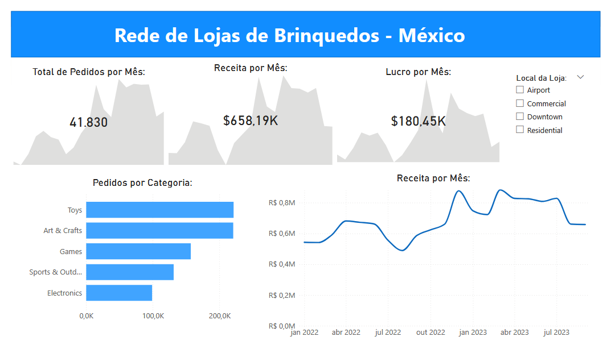

# Análise de Rede de Lojas de Brinquedos – México

Relatório interativo de Business Intelligence desenvolvido para uma rede de lojas de brinquedos com múltiplas unidades no México.

O objetivo deste projeto foi construir um **dashboard simples, interativo e estratégico**, permitindo que a liderança acompanhe métricas-chave do negócio e tendências de alto nível no período de **janeiro de 2022 a setembro de 2023**.

---

## Problema de Negócio:

A empresa possui diferentes tipos de lojas (Airport, Commercial, Downtown e Residential) e precisava de uma visão centralizada para monitorar:

- Total de pedidos
- Receita
- Lucro
- Vendas por categoria
- Tendências mensais
- Desempenho por localização

O foco foi criar um relatório:

- Intuitivo
- Interativo
- Visualmente claro
- Voltado para tomada de decisão estratégica

---

## Etapas do Projeto:

### 1 Conexão e Análise Exploratória dos Dados

- Conexão com os dados brutos de vendas
- Limpeza e tratamento de inconsistências
- Padronização de campos de data
- Verificação de valores nulos
- Validação de cálculos de receita e lucro
- Análise exploratória inicial para entendimento do comportamento dos dados

---

### 2 Modelagem Relacional

Foi construída uma modelagem seguindo o conceito de **Star Schema**, incluindo:

- **Tabela Fato:** Vendas  
- **Tabelas Dimensão:**
  - Calendário
  - Local da Loja
  - Categoria de Produto

Relacionamentos foram definidos para garantir agregações corretas e filtros eficientes.

---

### 3 Criação de Medidas e Campos Calculados (DAX)

Foram desenvolvidas medidas essenciais para monitoramento do negócio:

- Total de Pedidos
- Receita Total
- Lucro Total
- Receita por Mês
- Lucro por Mês
- Pedidos por Categoria
- Receita por Localização

Também foram aplicados cálculos de inteligência temporal para análise de tendências mensais.

---

### 4 Construção do Relatório Interativo

O dashboard inclui:

### 🔹 Indicadores Principais (KPIs)
- **Total de Pedidos:** 41.830  
- **Receita Total:** $658,19K  
- **Lucro Total:** $180,45K  

### 🔹 Tendência de Receita Mensal
Gráfico de linha para acompanhamento de crescimento e sazonalidade.

### 🔹 Pedidos por Categoria
Comparação entre:
- Toys
- Art & Crafts
- Games
- Sports & Outdoor
- Electronics

### 🔹 Filtro por Localização da Loja
Segmentação interativa permitindo análise por:
- Airport
- Commercial
- Downtown
- Residential

---

## Principais Insights:

- Tendência de crescimento da receita ao longo do período analisado.
- As categorias Toys e Art & Crafts apresentam maior volume de pedidos.
- Diferenças de desempenho entre tipos de loja podem ser identificadas via filtro.
- Monitoramento simultâneo de receita e lucro permite avaliar margem e eficiência operacional.

---

## Como Visualizar:

1. Baixe o arquivo `.pbix`
2. Abra no Power BI Desktop
3. Utilize os filtros interativos para explorar os dados

---

### Objetivos do Projeto:

Demonstrar a capacidade de transformar dados brutos de varejo em um painel estratégico que apoia a tomada de decisão orientada por dados.

--
**Gabriel França da Silva**  
Estudante de Ciência e Tecnologia – UFABC  
Interessado em Business Intelligence e Análise de Dados  

🔗 LinkedIn: https://www.linkedin.com/in/gabrielfranca123
🔗 GitHub: https://github.com/TayschreN  

